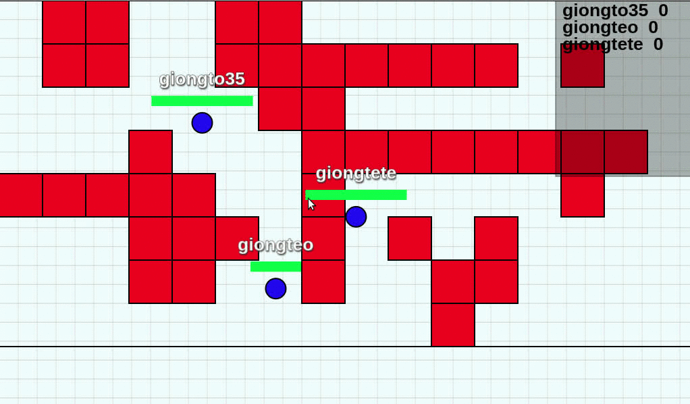

# GOWOG, Open source GOlang Web-based Online Game

GOWOG is a multiplayer web game written in Golang. Thanks to Golang, the server can handle a large number of players concurrently.

## Try the game

http://game.giongto35.com

### Local

You can try the game on local by running `./run_local.sh`. It will build a docker environment and run the game on port 8080.

Open the browser "localhost:8080"

## Development

The game contains two part: Server and Client. Server uses Golang and Client uses Node.JS.

#### Server

Install Golang https://golang.org/doc/install
Install dependencies
  * `go get github.com/gorilla/websocket`
  * `go get github.com/golang/protobuf/protoc-gen-go`
  * `go get github.com/pkg/profile`
Run the server. The server will listen at port 8080.
Go to *gowog* folder
  * `go run server/cmd/server/*`
 
#### Client

Install NodeJS https://nodejs.org/en/download/

Go to *gowog/client* folder

Install dependencies

  * npm install

Run the client. The client will listen at port 3000. env.HOST_IP is the host of server

  * `npm run dev -- --env.HOST_IP=localhost:8080`

Open the browser "localhost:3000"

**Note**: 

In development we run client on port 3000 and server on port 8080 separately.

In production and docker environment, there is only one server running on port 8080 which returns html on the same port, so if we run docker, the browser is "localhost:8080".

#### Communication convention

Communication packages between server and client is based on protobuf. Install protoc for protobuf generate.

  * http://google.github.io/proto-lens/installing-protoc.html

Everytime you change package singature in */sertver/message.proto*. Run 

  * go to `gowog/server`

  * `/generate.sh`

## Document

[**Frontend**](client)

[**Backend**](server)

## FAQ

#### Why we need Golang for multiplayer game?

Building a massively multiplayer game is very difficult and it's currently overlooked. You have to ensure the latency is acceptable, handle shared states concurrently and allow it to scale vertically. Golang provides a very elegant concept to handle concurrency with goroutine and channel.

#### Why the gameplay is so simple and frontend codebase is so unorganized?

The gameplay is mainly for demonstration purpose. My goal is to keep the game simple as current and scale number of players vertically while maintaining good latency (< 100ms). I welcome all of your ideas to make the game more scalable.

However, I'm still open to Graphic improvement and client codebase refactor. I would love to see some particles burst or glow, motion effects. Remember that different people have different perspective on how the game should look, so we need full consensus before making ui change.

#### Why the game only runs on single core?

The game indeed can run well on multi-core parallelly. After some comparision, running on multi-core showed the slower performance due to high channel and lock contention.

We need a better design to reduce context switch and contention.

#### If the game runs on single core, why needs to you channel? Why don't fully go with NodeJS for server and callback model?

Remember, concurrency is not parallelism. Context switch can happen everytime. GoRoutine and GoChannel is very elegant solution to deal with concurrency. And it's easier and more intuitive than with Callback model (a.k.a Callback hell).

#### Why protobuf?

To optimize package size, we need to compress it into binary. Protobuf offers fast language-neutral serialization and deserilization, so Golang server can communicate with JS client in an optimal way.

We can consider faster serilization format like Cap'n Proto or FlatBuffers.

#### Why the multiplayer game is not room-based (less than 20 players per game)

In my opinion, room-based is less challenging because each room is totally separated from each other and we can scale the game easier by adding more instances. This repo is to illustrate how many players the game can serve on one multi-core single machine.

And of course my ultimate goal is to make the non room-based game scale vertically by adding more instances.

## Contribution guidelines

I'm looking forward to have your contribution to GOWOG, which can help the game smoother and more scalable. If you have any ideas to improve game performance, please discuss in this issue [Discussion](https://github.com/giongto35/gowog/issues/2).

I also welcome frontend improvement like codebase reorganization, performance enhancement. In the case you want to improve the UI, please create an issue to show the new design so we can make an agreement on that.

As my desire is to utilize Golang concurrency paradigm to achieve *smooth gaming experience with massive number of players*, I will keep the gameplay simple. Player can move around and shoot each other. Any gameplay changes are not accepted.

## Credits

https://github.com/gorilla/websocke/blob/master/examples/chat
https://github.com/RenaudROHLINGER/phaser-es6-webpack
https://github.com/huytd/agar.io-clone (My inspiration)

## LICENSE

[MIT License](LICENSE)

## Contributor

Nguyen Huu Thanh  
https://www.linkedin.com/in/huuthanhnguyen/
