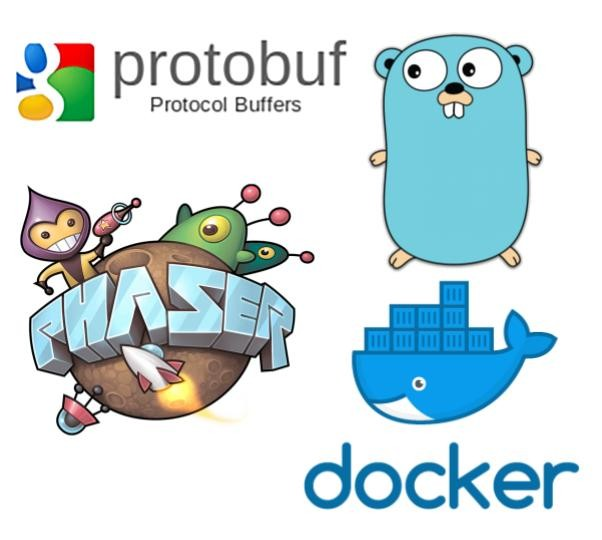

# GOWOG, Golang based Multiplayer online game

GOWOG is the open source MMO game written by Golang.  
On top of that, it opens AI environment for Machine learning enthusiasts to implement AI Bot. The environment can setup to connect to server directly, so we can compete each other on the environment.

## Try the game

game.giongto35.com

## Development environment

You can try running local environment by running `./run_local.sh`. It will build a docker environment and run the game.

## Architecture


# Code architecture

## Document
[**Frontend**](client)

[**Backend**](server)

[**AIEnvironment**](gym)

## Codebase
```
.
├── client
│   ├── index.html
│   ├── src
│   │   ├── config.js: javascript config
│   │   ├── index.html
│   │   ├── main.js
│   │   ├── sprites
│   │   │   ├── Leaderboard.js: Leaderboard object
│   │   │   ├── Map.js: Map object
│   │   │   ├── Player.js: Player object
│   │   │   └── Shoot.js: Shoot object
│   │   ├── states
│   │   │   ├── Boot.js Boot screen
│   │   │   ├── const.js
│   │   │   ├── Game.js: Game master
│   │   │   ├── message_pb.js: Protobuf Message
│   │   │   ├── Splash.js
│   │   │   └── utils.js
│   │   └── utils.js
├── server
│   ├── buildwall.js
│   ├── cmd
│   │   └── server
│   │       └── server.go: Entrypoint running server
│   ├── game
│   │   ├── common
│   │   ├── config
│   │   │   └── 1.map: Map represented 0 and 1
│   │   ├── eventmanager
│   │   ├── gameconst
│   │   ├── game.go
│   │   ├── mappkg
│   │   ├── objmanager
│   │   ├── playerpkg
│   │   ├── shape
│   │   ├── shootpkg
│   │   ├── types.go
│   │   └── ws
│   │       ├── types.go
│   │       ├── wsclient.go
│   │       └── wshub.go
│   ├── generate.sh: Generate protobuf for server + client + AI environment
│   ├── message.proto
│   └── Message_proto
│       └── message.pb.go
├── Dockerfile
└── run_local.sh
```

# Credits

https://github.com/RenaudROHLINGER/phaser-es6-webpack

# Contributor

Nguyen Huu Thanh  
thanhnguyen17101994@gmail.com  
https://www.linkedin.com/in/huuthanhnguyen/
